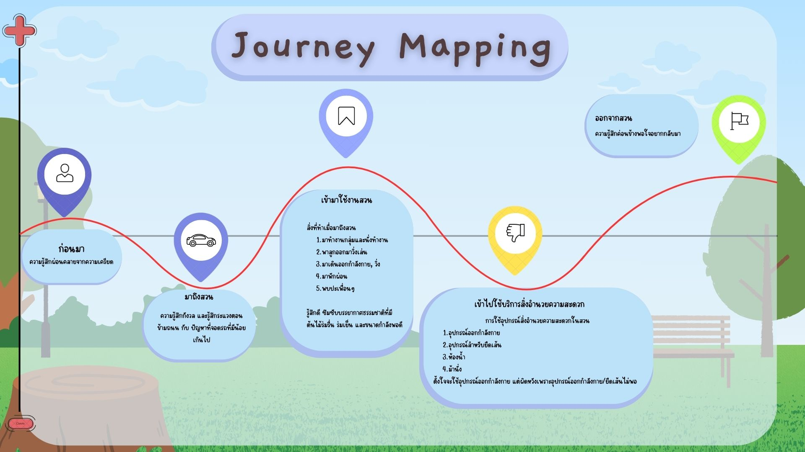
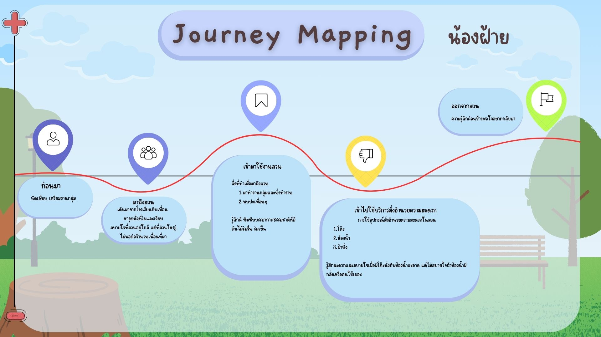
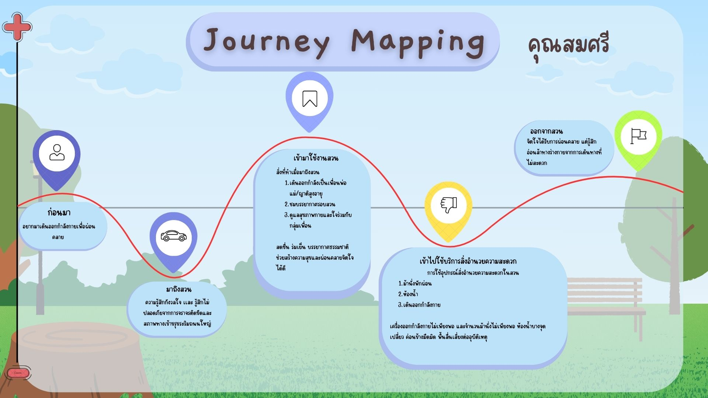
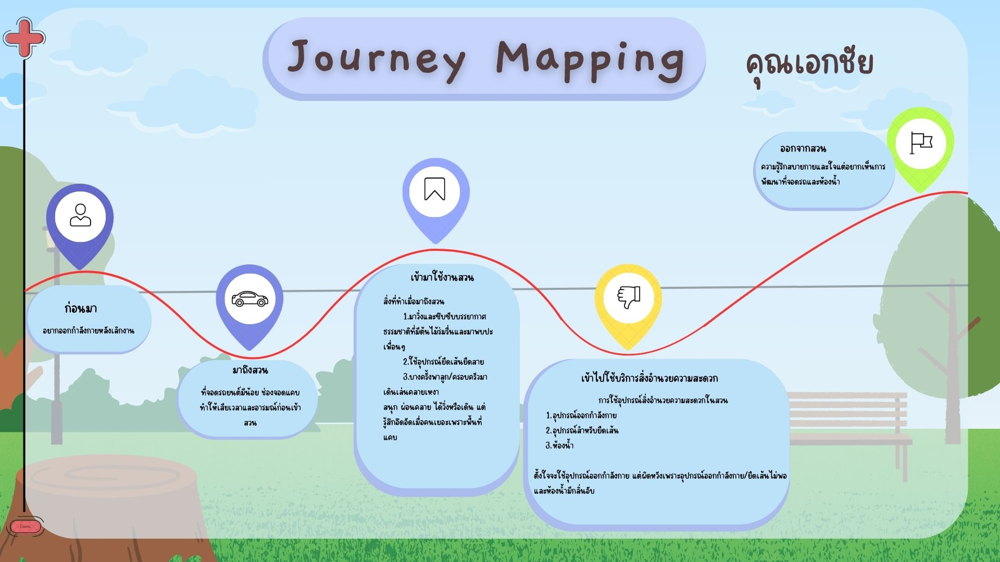
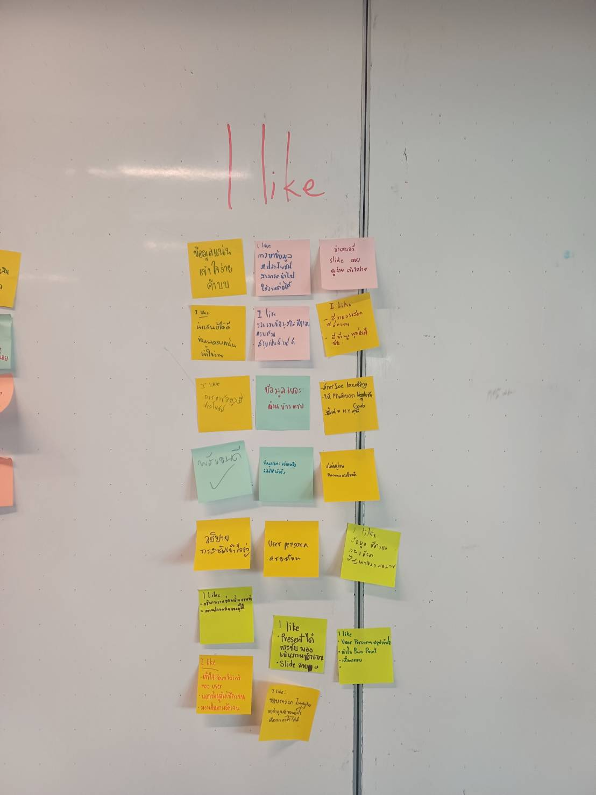
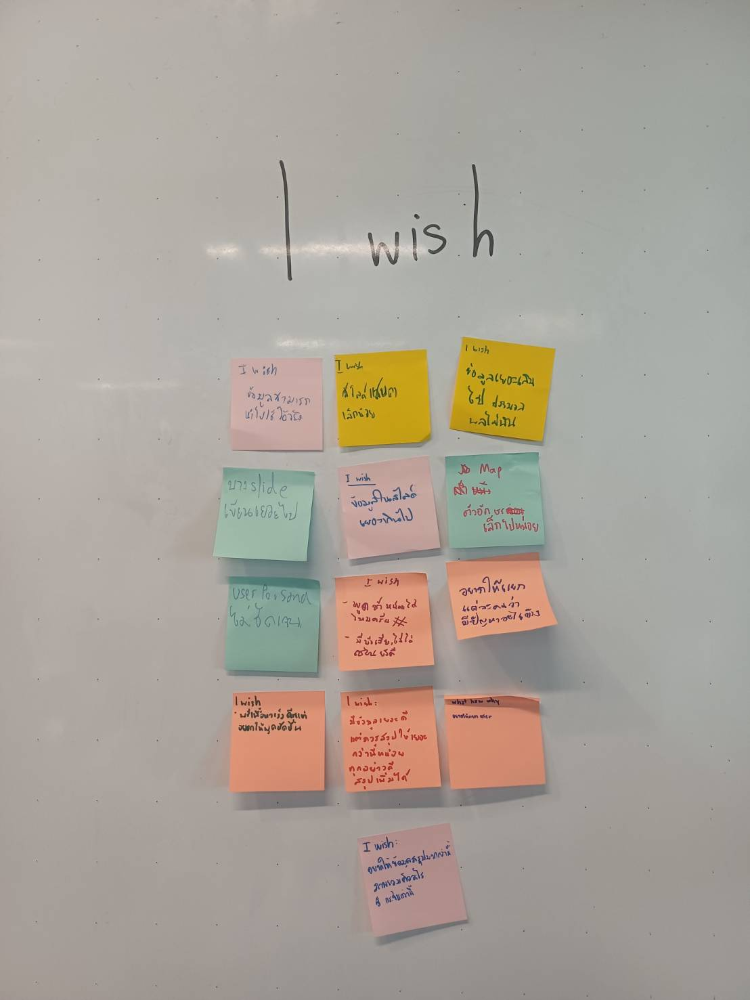
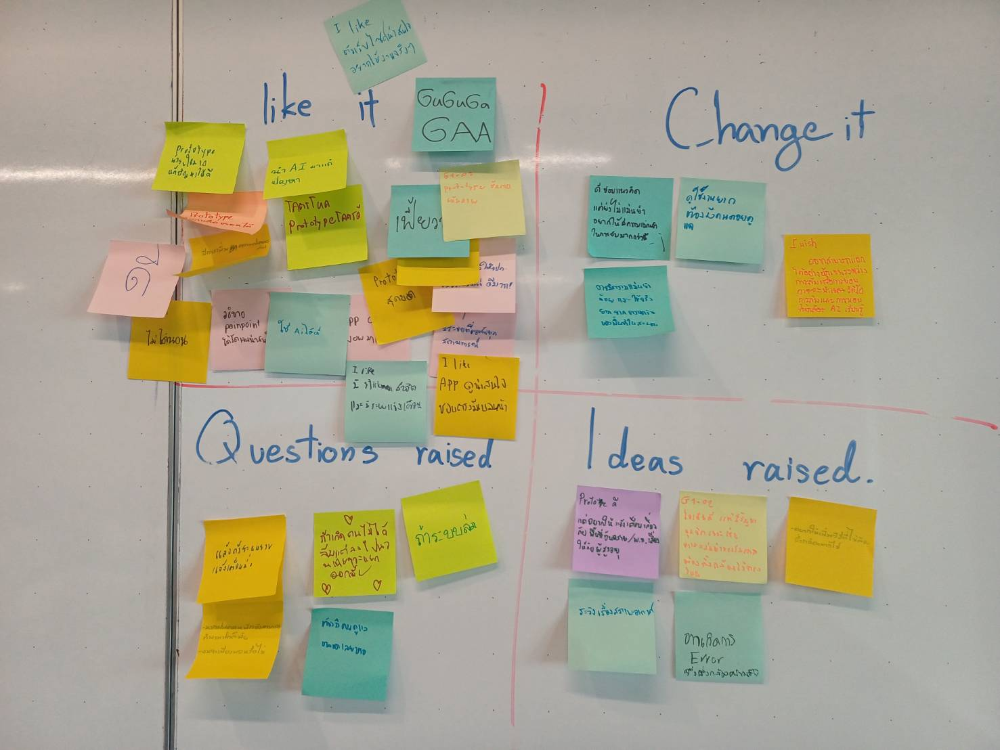

# รายงานสรุปกระบวนการ Design Thinking
## ระบบกล้องตรวจจับความปลอดภัยในสวนสาธารณะ
### ทีม GUGUGAGA | รายวิชา INT100 กลุ่ม G1-04

**Repository:** github.com/Aomtana0070/INT100_G1-04-GUGUGAGA

---

## สมาชิกทีม

| ชื่อเล่น | ชื่อ-นามสกุล | GitHub |
|---|---|---|
| อังเปา | ณธรรศ ลิ้มสวัสดิ์ | Aomtana0070 (ดูแลระบบ repo และ merge) / ungpao-24 |
| อิน | ศรุดา สุวรรณกล่อม | SarudaS |
| ออม | ธนาพิสิษฐ์ อ่อนสร้อย | Aomtana0070 |
| โชกุน | รวิชญ์ สังข์ภิรมย์ | norrawit45-sys |
| จอห์น | จอห์น ตั้น | johntan-1 |
| ฮิว | วัชชิรพงษ์ ธนโชติคณาทิวัตถ์ | watchirapong |

---

## 1. EMPATHIZE (ทำความเข้าใจผู้ใช้)

### 1.1 Interview Script

**ช่วงเปิดบทสนทนา & ทำความรู้จัก (Warm-up)**
- ปกติมาใช้งานสวนสาธารณะบ่อยแค่ไหน และมักจะมาช่วงเวลาไหน?
- ส่วนใหญ่มาทำกิจกรรมอะไรเป็นหลัก?

**เจาะลึกประสบการณ์และความรู้สึก (Deep Dive)**
- ช่วยเล่าถึงวันที่มาสวนแล้วรู้สึกประทับใจ หรือวันที่เจอเหตุการณ์น่าหงุดหงิด
- เวลาใช้งานสิ่งอำนวยความสะดวก (ห้องน้ำ, จุดเติมน้ำ, ถังขยะ, ที่นั่ง, ไฟส่องสว่าง) มีจุดไหนที่ยังไม่สะดวกหรือไม่ปลอดภัยบ้าง?

**สะท้อนความต้องการที่แท้จริง (Wrap-up & Needs)**
- ถ้าเลือกปรับเปลี่ยนหรือเพิ่มสิ่งใหม่ในสวนได้ 1 อย่าง อยากให้มีอะไรมากที่สุด เพราะอะไร?

### 1.2 User Persona

**Persona 1: "น้องฝ้าย" (กลุ่มวัยรุ่น/นักศึกษา)**
- อายุ 18 ปี, นักเรียน, มาสวน 3–4 วัน/สัปดาห์หลังเลิกเรียน
- Behavior: ทำงานกลุ่ม/การบ้านกับเพื่อน, นั่งเล่นพักผ่อน
- Pain Point: ที่นั่ง/ศาลาไม่พอสำหรับนั่งกลุ่ม, ห้องน้ำสกปรกมีกลิ่นเหม็น
- Insight: อยากได้พื้นที่นั่งทำงานกลุ่มขนาดใหญ่ขึ้น, ห้องน้ำสะอาดขึ้น, พื้นที่เงียบพอโฟกัสงานแต่ยังมีบรรยากาศธรรมชาติ

**Persona 2: "คุณเอกชัย" (กลุ่มวัยทำงาน/ครอบครัว)**
- อายุ 41 ปี, มนุษย์เงินเดือน, มาสวนเกือบทุกวัน (4–5 วัน/สัปดาห์) ช่วงเย็น
- Behavior: วิ่งออกกำลังกาย พบเพื่อน, พาครอบครัวมาเดินเล่น
- Pain Point: ที่จอดรถน้อย/คับแคบ, ห้องน้ำชายมีกลิ่นเหม็น, อุปกรณ์ออกกำลังกายไม่พอ
- Insight: อยากให้มีที่จอดรถกว้างขึ้น, อยากให้ลูกได้ออกมาข้างนอก, อยากได้อุปกรณ์ออกกำลังกายครบและสะอาด

**Persona 3: "คุณสมศรี" (กลุ่มผู้สูงอายุ)**
- อายุ 62 ปี, ทำธุรกิจส่วนตัว, มาสวนแทบทุกวันโดยเดินมา
- Behavior: เดินออกกำลังกายรอบสวน (~1,100 เมตร), ดูแลสุขภาพกาย-ใจ
- Pain Point: ถนนหน้าสวนเสี่ยงอุบัติเหตุ, ไม่มีรั้ว/ขอบกั้นสระน้ำสูงพอ, ไม่มีจุดปฐมพยาบาล, ม้านั่ง/เครื่องออกกำลังกายไม่พอ, ห้องน้ำมืดทึบเปลี่ยว
- Insight: อยากให้มีเจ้าหน้าที่ดูแลความปลอดภัยประจำจุด, ปรับปรุงความปลอดภัยรอบสระน้ำ, มีจุดปฐมพยาบาล, ปรับแสงสว่าง

### 1.3 What-How-Why

| มิติ | รายละเอียด |
|---|---|
| **What**  | ออกกำลังกาย, ทำงานกลุ่ม, หาเพื่อน/พบปะผู้คน, ชมทัศนียภาพ, พักผ่อนคลายเครียด |
| **How**  | มาสวนช่วงเย็นหลังเลิกงาน/เลิกเรียน, วิ่งร่วมกลุ่มเพื่อน, พาครอบครัวเดินเล่น |
| **Why**  | อยากพักผ่อนคลายเครียดจากชีวิตประจำวัน, อยากอยู่ท่ามกลางธรรมชาติ, อยากเปลี่ยนบรรยากาศจากที่ทำงาน, อยากพบปะสังสรรค์กับเพื่อน |

### 1.4 Say - Do - Think - Feel

- **Say:** สวนบรรยากาศดี ร่มเงาเย็นสบาย / ห้องน้ำเหม็นไม่สะอาด / ที่นั่งไม่พอ / ที่จอดรถไม่พอ / บางจุดเปลี่ยวไม่ได้รับการดูแล / การจราจรหน้าสวนอันตราย / ต้องการหน่วยพยาบาล
- **Do:** ทำงานกลุ่ม, ออกกำลังกาย, นั่งพักผ่อน, พาลูกเดินเล่น, ใช้สิ่งอำนวยความสะดวก, หาที่นั่ง/ที่จอดรถ
- **Think:** อยากให้สวนสะอาดขึ้น, ที่นั่งเพียงพอ (มีหลังคา), ที่จอดรถเยอะขึ้น, ปลอดภัยขึ้นโดยเฉพาะจุดเปลี่ยว, มีหน่วยพยาบาล, แสงสว่างเพียงพอ
- **Feel:** เชิงบวก - สบายใจ, ผ่อนคลาย, สดชื่น, พึงพอใจ / เชิงลบ - ระแวง, กังวลเรื่องความปลอดภัย, ไม่พอใจเรื่องความสะอาด

### 1.5 What You Have Inferred as Think-Feel

- ผู้ใช้มองว่าสวนเป็นที่ออกกำลังกายที่ดี เส้นทางไม่ซับซ้อน ใกล้ที่พัก แต่ลึกๆ ยังต้องการพื้นที่กันฝน ความปลอดภัยที่มากขึ้น และหน่วยพยาบาล
- ความรู้สึกโดยรวมเป็นบวก (สบายใจ ผ่อนคลาย สดชื่น) แต่มีความระแวงแฝงอยู่เมื่อต้องผ่านจุดเปลี่ยว

---

## 2. DEFINE (นิยามปัญหา)

### 2.1 Initial PoV Statement

- **We met:** ผู้ใช้สวนหลากหลายกลุ่ม (นักเรียน, ครอบครัว, ผู้สูงอายุ, ผู้พักผ่อน) มาใช้งานสม่ำเสมอ 3-4 วัน/สัปดาห์ เพราะใกล้บ้านและมีบรรยากาศธรรมชาติดี
- **We were surprised to notice:** แม้พูดว่าพอใจ แต่เมื่อพูดถึงสิ่งอำนวยความสะดวกจริง กลับกังวลและไม่สบายใจ โดยเฉพาะห้องน้ำสกปรก ที่นั่ง/ที่จอดรถไม่พอ
- **We wonder if this means:** ความพอใจอาจมาจากการที่ "มีทางเลือกน้อย" มากกว่าความสุขจริง ความสะอาด ความปลอดภัย และสิ่งอำนวยความสะดวก คือเงื่อนไขพื้นฐานที่หากไม่ถูกแก้ไข ผู้ใช้พร้อมเปลี่ยนไปที่อื่นทันทีที่มีตัวเลือก
- **Core insight:** "ผู้ใช้สวนดูพึงพอใจภายนอก แต่กำลังทนใช้งานท่ามกลางปัญหาพื้นฐานด้านความสะอาด ความปลอดภัย และสิ่งอำนวยความสะดวก เพราะไม่มีทางเลือกอื่นที่ดีกว่า"
- **It would be game-changing to:** ทำให้ผู้ใช้รู้สึกมั่นใจและปลอดภัยทุกครั้งที่ใช้งานสวน จนเปลี่ยนจาก "ทน" เป็น "เลือกใช้ด้วยความเต็มใจ"

### 2.2 User Journey Map (สรุป)

ภาพรวมดี แม้จะมีปัญหาย่อยบางประการ

##  User Journey Map by user prosona
**น้องฝ้าย**

**คุณสมศรี**

**คุณเอกชัย**

### 2.3 PoV Statement (Revised)

- **We wonder if this means (revised):** ความพอใจที่พูดถึงอาจสะท้อนแค่ "แก่นของสวน" (ธรรมชาติ+ทำเล) ซึ่งเป็นจุดแข็งจริง แต่ความสะอาด ความปลอดภัย และสิ่งอำนวยความสะดวก ทำหน้าที่เป็น **hygiene factors** - ไม่ได้เพิ่มความสุขเมื่อมีอยู่ แต่บั่นทอนความพึงพอใจทันทีเมื่อขาดหรือมีปัญหา
- **Core insight (revised):** "ผู้ใช้พึงพอใจกับแก่นของสวน แต่ความสะอาด ความปลอดภัย และสิ่งอำนวยความสะดวกที่ยังไม่ได้มาตรฐาน กำลังกัดกร่อนประสบการณ์อย่างเงียบๆ โดยผู้ใช้อาจไม่รู้ตัวว่านี่คือ 'พอใจแบบมีเงื่อนไข' ไม่ใช่ 'พอใจเต็มร้อย'"
- **It would be game-changing to (revised):** ยกระดับสิ่งอำนวยความสะดวกและความปลอดภัยให้ได้มาตรฐานอย่างสม่ำเสมอ เพื่อให้ผู้ใช้ทุกกลุ่มมั่นใจและปลอดภัยเต็มร้อย

### 2.4 How Might We (HMW)

1. **ความปลอดภัย:** ทำให้ผู้สูงอายุและครอบครัวที่มีเด็กเล็กเดินทางเข้า-ออกและใช้พื้นที่ในสวนได้อย่างปลอดภัย ทั้งจากการข้ามถนน จุดเปลี่ยว และขอบสระน้ำ?
2. **ความสะอาด & ความมั่นใจในสิ่งอำนวยความสะดวก:** ทำให้ห้องน้ำสะอาดและปลอดภัยพอที่ผู้ใช้ทุกวัยจะมั่นใจใช้งานคนเดียวได้ทุกช่วงเวลา?
3. **ระบบช่วยเหลือฉุกเฉิน:** สร้างระบบช่วยเหลือฉุกเฉินที่ผู้สูงอายุเข้าถึงได้ง่ายและรวดเร็วในทุกจุดของสวน?
4. **ความจุพื้นที่:** เพิ่มพื้นที่นั่งและที่จอดรถให้เพียงพอ โดยไม่กระทบพื้นที่สีเขียว?

---

## 3. IDEATE (ระดมความคิด)

### 3.1 Brainstorming

1. เก้าอี้ยืดเส้น
2. เครื่องปล่อยน้ำยาล้างห้องน้ำอัตโนมัติ
3. เครื่องแจ้งเตือนความปลอดภัย
4. **กล้องวงจรปิดตรวจจับอุบัติเหตุ**
5. ที่อาบน้ำตัวเงินตัวทอง

### 3.2 จัดกลุ่มไอเดีย (Rational / Darling / Delight / Long Shot)

| กลุ่ม | ไอเดีย |
|---|---|
| **Rational** (ทำได้จริง สมเหตุสมผล) | เครื่องปล่อยน้ำยาล้างห้องน้ำอัตโนมัติ, เก้าอี้ยืดเส้น |
| **Darling** (ทีมชื่นชอบ) | ที่อาบน้ำตัวเงินตัวทอง |
| **Delight** | เครื่องแจ้งเตือนความปลอดภัย |
| **Long Shot** (แก้ไขระยะยาว) | กล้องวงจรปิดตรวจจับอุบัติเหตุ |

### 3.3 Final Idea

**กล้องวงจรปิดตรวจจับอุบัติเหตุ** → พัฒนาต่อเป็นโปรเจค **"ParkGuard"**
### Feedback from another 
####  I like 

####  I wish

---

## 4. PROTOTYPE

### 4.1 Version 0.1 — UI Concept Mockup & Simulation Demo
- Concept: ออกแบบ Security Web Dashboard และจำลองตรรกะตรวจจับ (Simulation Logic)
- Top Metrics Bar: สถานะการเชื่อมต่อกล้อง, AI Win Rate (98.4%), Today Incidents, Safe Duration Streak
- Live Feed Canvas Simulation: จำลอง RTSP 1080p@30FPS/CUDA พร้อมปุ่ม `Full Frame`, `Draw ROI`, `Clear ROI`, `Simulate Fall`
- Fallback Pose Detection Demo: ปกติ = กรอบเขียว `Person 96%` / ล้ม = คำนวณ W/H Ratio (2.6 > 1.1) → ` FALL DETECTED!` กรอบแดง
- Incident Audit Log: ตารางประวัติเหตุการณ์ แบ่งระดับ CRITICAL/MEDIUM/LOW และสถานะ RESOLVED
- AI Assistant Module: ส่วนต่อประสานกับ Luna AI Log

### 4.2 Version 1.0 — Initial Core System
- Concept: ระบบตรวจจับคนหกล้มและแจ้งเตือนผ่าน Discord ด้วย YOLOv8-Pose
- ประมวลผลภาพจาก Webcam ความละเอียด 1280x720
- ตรวจจับการหกล้มด้วย Aspect Ratio (w/h > 1.1) ร่วมกับ Fall Duration Threshold
- **Issues Found:** ขนาดกล้อง cv2 เล็กไป, ยังไม่เชื่อมกับ Dashboard

### 4.3 Version 2.0 — Pose Keypoints PDPA & Visual ROI
- Concept: แก้ปัญหาการคุ้มครองข้อมูลส่วนบุคคล (PDPA) และแสดงพื้นที่เสี่ยง
- **Smart PDPA Blur:** ใช้ Pose Keypoints (จมูก ตา หู) + Dynamic Margin เบลอใบหน้าได้ 100% ทุกอิริยาบถ (ยืน นั่ง นอนล้ม)
- **Visual ROI Overlay:** กรอบสีส้มโปร่งแสงแสดงพื้นที่เสี่ยงบน Live Feed
- **FastAPI Dashboard:** เปิด/ปิดโหมด ROI และ PDPA ผ่าน REST API, Drag & Drop เลือกพื้นที่เสี่ยงบนเว็บ
- **Limitations:** ยังไม่สามารถปรับพิกัดพื้นที่เสี่ยงตามต้องการบนหน้าเว็บได้แบบยืดหยุ่นเต็มที่

### Feedback from another teams
#### like it | Change it | Questions aised | Ideas raised

---

## 5. TEST (ทดสอบกับผู้ใช้จริง)

### 5.1 Test Scripts

**กลุ่มผู้ทดสอบ:** 6 คน (นักศึกษา 2, ยาม 2, แม่บ้าน 2) - รูปแบบ semi-structured interview + demo

1. โดยรวมคิดเห็นอย่างไรกับโปรแกรมนี้?
2. คิดว่าไอเดียนี้ใช้งานได้จริงหรือไม่ เพราะอะไร?
3. คิดว่าระบบตรวจจับได้แม่นยำแค่ไหน?
4. ถ้ามีคนนั่งอยู่เฉยๆ ระบบจะตรวจจับว่าอย่างไร? แยกแยะ "นั่ง" กับ "นอน" ได้หรือไม่?
5. ถ้ามีสัตว์เลี้ยงในพื้นที่ ระบบจะเกิด error หรือไม่?
6. คิดว่า AI ตรวจจับได้ดีกว่าคนอย่างไร?
7. อยากให้มีฟีเจอร์อะไรเพิ่มเติม?
8. (เฉพาะยาม) ถ้าระบบแจ้งเตือนคนล้ม อยากให้เร็วแค่ไหนถึงจะช่วยทัน?
9. (เฉพาะแม่บ้าน) ปัญหาที่กังวลบ่อยที่สุดในการดูแลพื้นที่คืออะไร?

### 5.2 Feedback Capture Matrix

| + (ชอบ) | Δ (ควรปรับปรุง) |
|---|---|
| [นักศึกษา 1] โดยรวมโปรแกรมออกมาดี | [นักศึกษา 2] อยากให้เพิ่มระบบอัปเดตแพตช์ |
| [ยาม 1] มองว่าโปรเจคมีความเป็นไปได้ | [แม่บ้าน 1] ยังไม่มั่นใจเรื่องความแม่นยำ/ขอบเขตการตรวจจับ (นั่ง-นอน, สัตว์เลี้ยง) |
| [แม่บ้าน 2] ชื่นชมว่าดี เพราะช่วยเฝ้าระวังขโมย | [ยาม 1] ยังต้องใช้เวลาทดลองเพิ่มก่อนสรุปประสิทธิภาพ |
| [แม่บ้าน 2] มองว่าน่าจะมีประโยชน์ถ้านำมาใช้จริง | [แม่บ้าน 2] บางครั้งเฝ้าดูเองไม่ทัน |
| | [ยาม 2] ต้องการให้ตรวจจับคนล้มได้รวดเร็วและแม่นยำกว่านี้ |

| ? (คำถาม) | 💡 (ไอเดียใหม่) |
|---|---|
| [นักศึกษา 1] ตรวจจับได้แม่นยำจริงหรือไม่ ใช้งานได้จริงหรือเปล่า | [นักศึกษา 2] เพิ่มระบบอัปเดตแพตช์ |
| [นักศึกษา 2] ไอเดียนี้ใช้งานได้จริงหรือไม่ | [ยาม 2] พัฒนาโมดูล fall detection แบบเรียลไทม์ |
| [นักศึกษา 2] AI ดีกว่าคนอย่างไร | |
| [แม่บ้าน 1] คนนั่งอยู่เฉยๆ จะถูกตรวจจับอย่างไร | |
| [แม่บ้าน 1] แยกแยะ "นั่ง" กับ "นอน" ได้หรือไม่ | |
| [แม่บ้าน 1] ความแม่นยำของโมเดลอยู่ที่ระดับใด | |
| [แม่บ้าน 1] สัตว์เลี้ยงจะทำให้เกิด error หรือไม่ | |

### 5.3 Iteration Analysis - ต้องย้อนกลับไปขั้นตอนใด

| Mode | หลักฐาน | สิ่งที่ต้องทำ |
|---|---|---|
| **Empathize** | คำถามเรื่อง AI vs คน, ขอบเขตการตรวจจับ (สัตว์เลี้ยง, นั่ง/นอน) | สัมภาษณ์/สังเกตผู้ใช้เพิ่มเติมเพื่อเก็บ edge case ที่ยังไม่ครอบคลุม |
| **Define** | Pain point ชัดที่สุดของยามคือ fall detection แบบเรียลไทม์ | พิจารณาเจาะจง POV ให้แคบลง มาโฟกัสที่การแจ้งเตือนเหตุการณ์แบบเรียลไทม์ |
| **Prototype** | กังวลเรื่องความเร็ว/ความแม่นยำ fall detection, ต้องการระบบอัปเดตแพตช์ | ปรับปรุงโมดูลตรวจจับการล้มให้เร็ว/แม่นยำขึ้น, เพิ่มการจัดการกรณีสัตว์เลี้ยง/ท่านั่ง-นอน, เพิ่มระบบอัปเดตแพตช์ |
| **Test** | ยามระบุว่ายังต้องใช้เวลาทดลองเพิ่ม | วางแผนทดสอบรอบใหม่ในสถานการณ์จำลองจริง วัด accuracy และความเร็วแจ้งเตือน |

**สรุปทิศทางถัดไป:** ย้อนกลับไป **Empathize (เก็บข้อมูลเพิ่ม)** → **Prototype (ปรับปรุงโมดูล fall detection + เพิ่มแพตช์อัปเดต)** → **Test รอบใหม่**

---

## 7. สรุปภาพรวมโปรเจค

โปรเจค **ระบบกล้องตรวจจับความปลอดภัยในสวนสาธารณะ** เกิดจากการทำ Design Thinking เต็มกระบวนการ เริ่มจากการสัมภาษณ์ผู้ใช้สวนสาธารณะ 3 กลุ่มหลัก (นักเรียน/นักศึกษา, วัยทำงาน/ครอบครัว, ผู้สูงอายุ) พบว่าแม้ผู้ใช้จะพอใจกับบรรยากาศธรรมชาติของสวน แต่มีความกังวลเรื่องความปลอดภัยและความสะอาดแฝงอยู่ โดยเฉพาะกลุ่มผู้สูงอายุที่กังวลเรื่องอุบัติเหตุและการไม่มีระบบช่วยเหลือฉุกเฉิน

ทีมจึงพัฒนาแนวคิด **ระบบกล้องตรวจจับความปลอดภัยในสวนสาธารณะ** ขึ้นมาเป็น prototype 3 เวอร์ชัน ตั้งแต่ UI concept, ระบบตรวจจับการล้มด้วย YOLOv8-Pose พร้อมแจ้งเตือนผ่าน Discord, จนถึงเวอร์ชันที่คำนึงถึงความเป็นส่วนตัว (PDPA Blur) และมี Dashboard ควบคุมผ่านเว็บ

ผลการทดสอบกับผู้ใช้เป้าหมาย 6 คน สะท้อนว่าแนวคิดได้รับการตอบรับที่ดี โดยเฉพาะจากกลุ่มยามและแม่บ้านที่มี pain point ชัดเจน แต่ยังมีจุดที่ต้องพัฒนาต่อ ได้แก่ ความเร็ว/ความแม่นยำของการตรวจจับการล้ม และการรองรับกรณีพิเศษ เช่น สัตว์เลี้ยงหรือท่านั่ง-นอน เป็นต้น

