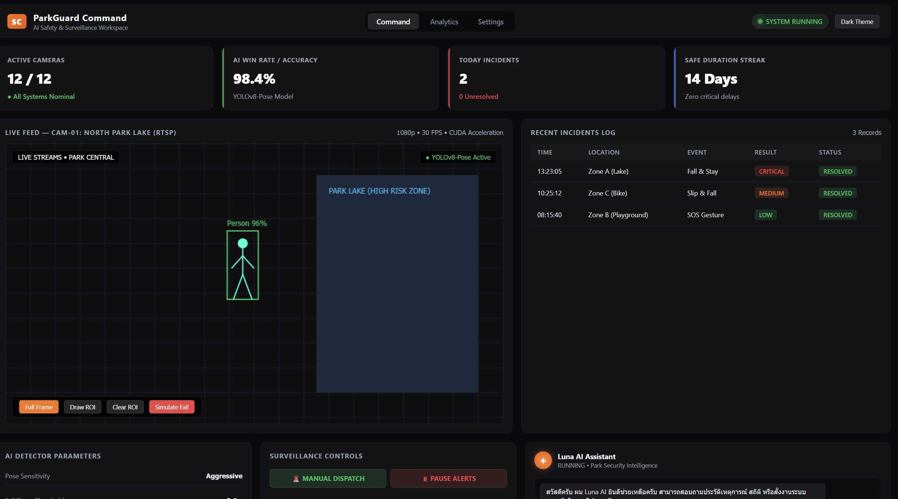
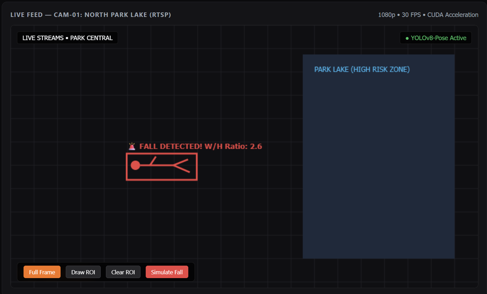
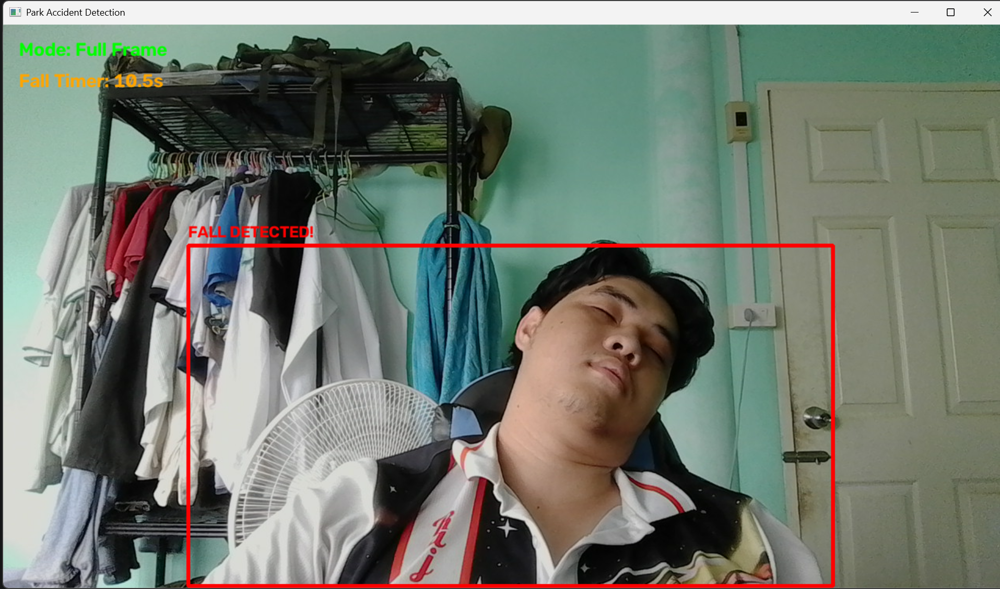
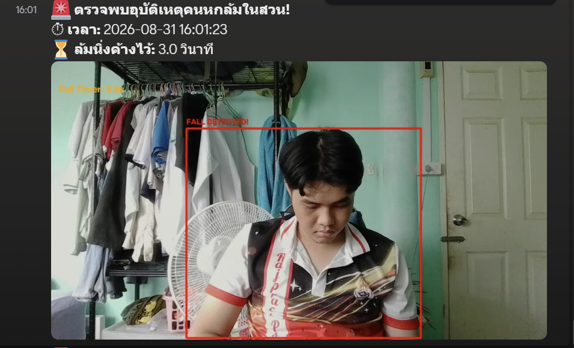
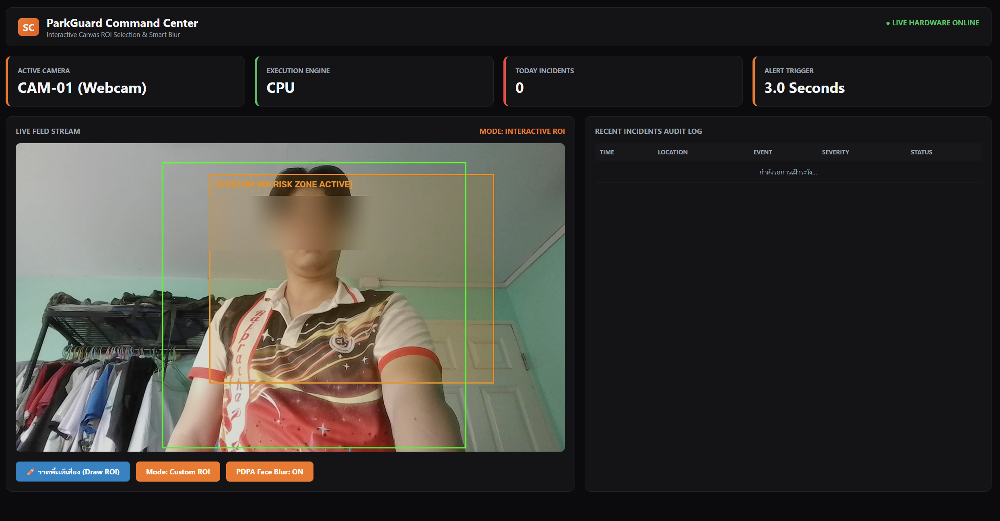
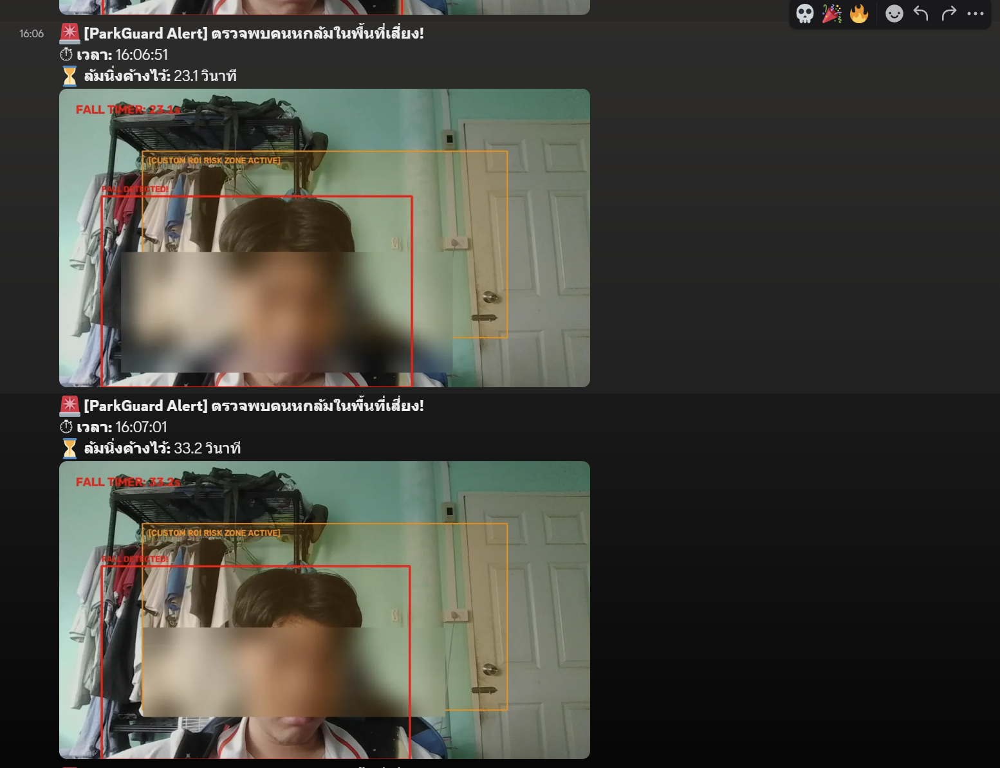

# Prototype

### 📌 Version 0.1 — UI Concept Mockup & Simulation Demo

* **Concept:** ออกแบบโครงร่างหน้าจอเฝ้าระวัง (Security Web Dashboard) และจำลองตรรกะตรวจจับ (Simulation Logic)
* **Key Components & Layout:**
  * **Top Metrics Bar:** แสดงสถานะการเชื่อมต่อกล้อง , ค่าความแม่นยำ AI Win Rate (98.4%), ยอดรวมเหตุการณ์ประจำวัน (Today Incidents) และสถิติความปลอดภัย (Safe Duration Streak)
  * **Live Feed Canvas Simulation:** หน้าจอจำลองการประมวลผลวิดีโอ RTSP (1080p @ 30 FPS / CUDA Acceleration) พร้อมปุ่มทดสอบระบบ (`Full Frame`, `Draw ROI`, `Clear ROI`, `Simulate Fall`)
  * **Fallback Pose Detection Demo:** 
    * สภาวะปกติ: แสดงตัวมนุษย์จำลอง (Stick Figure) พร้อมกรอบสีเขียว `Person 96%`
    * สภาวะล้ม (Simulated Fall): คำนวณอัตราส่วนความกว้างต่อความสูง ($W/H \text{ Ratio} = 2.6 > 1.1$) เพื่อแสดงสถานะ `🚨 FALL DETECTED!` พร้อมกรอบสีแดง
  * **Incident Audit Log Table:** ตารางแสดงประวัติเหตุการณ์ย้อนหลัง แบ่งระดับความรุนแรง (`CRITICAL`, `MEDIUM`, `LOW`) และสถานะการจัดการ (`RESOLVED`)
  * **AI Assistant Module:** ออกแบบส่วนต่อประสานกับ Luna AI Log
* **Purpose:** ใช้เป็นแบบร่าง UI สำหรับเก็บ Requirements และสาธิตอัลกอริทึม $W/H \text{ Ratio}$ ก่อนลงมือเขียนโค้ดประสานในเวอร์ชันถัดไป

#  ParkGuard Prototype
# 📌 Version 1.0 — Initial Core System

* **Concept:** ระบบตรวจจับคนหกล้มและแจ้งเตือนผ่าน Discord เบื้องต้นด้วย YOLOv8-Pose
* **Key Features:**
  * ประมวลผลภาพจาก Webcam ความละเอียด 1280x720
  * ตรวจจับการหกล้มด้วยอัตราส่วน Aspect Ratio ($w/h > 1.1$) ร่วมกับระบบจับเวลาค้าง (Fall Duration Threshold)
* Issues Found:
    *   **ขนาดกล้อง cv.2 เล็กไป**
    *   **ยังไม่เชื่อมกับ Dashboard**

---
# 📌 Version 2.0 — Pose Keypoints PDPA & Visual ROI

* **Concept:** แก้ไขจุดบกพร่องเรื่องการคุ้มครองข้อมูลส่วนบุคคล (PDPA) และแสดงผลพื้นที่เสี่ยง
* **Key Features:**
  * **Smart PDPA Blur:** เปลี่ยนมาใช้จุด Pose Keypoints (จมูก ตา หู) ร่วมกับ Dynamic Margin ช่วยให้เบลอใบหน้าได้ 100% ครอบคลุมทุกอิริยาบถ (ยืน นั่ง นอนล้ม)
  * **Visual ROI Overlay:** เพิ่มกรอบสีส้มโปร่งแสง (Translucent Overlay) แสดงขอบเขตพื้นที่เสี่ยงบนหน้าจอ Live Feed
  * **FastAPI Dashboard:** พัฒนา Web Dashboard เบื้องต้นเพื่อเปิด/ปิดโหมด ROI และ PDPA ผ่าน REST API
  * **Dashboard add**
  * **Drag & Drop ROI: ลากเมาส์เลือกพื้นที่เสี่ยงบนหน้าเว็บได้ทันที**
* **Limitations (ปัญหาที่พบ):**
  * แม้จะแสดงพื้นที่ ROI ได้ชัดเจน แต่ผู้ใช้ยังไม่สามารถปรับเปลี่ยนพิกัดพื้นที่เสี่ยงตามความต้องการบนหน้าเว็บได้
  

