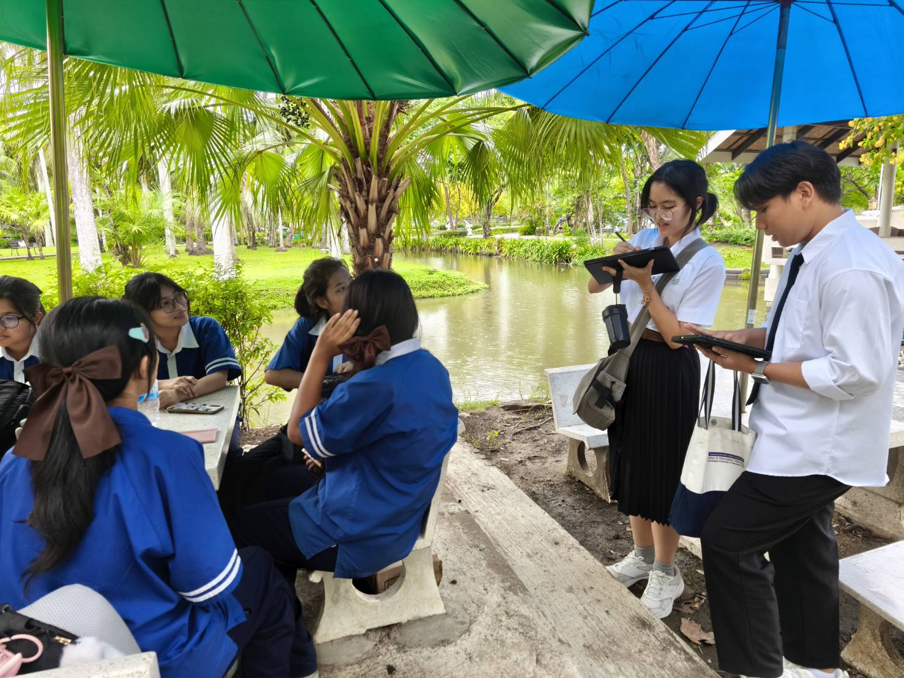
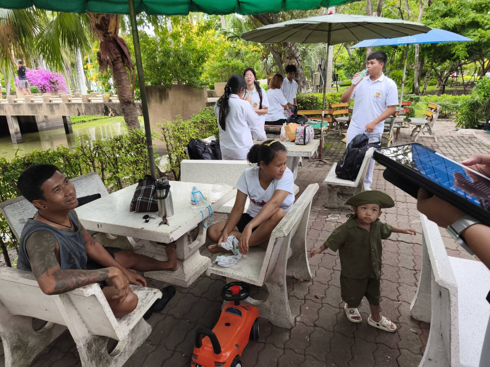
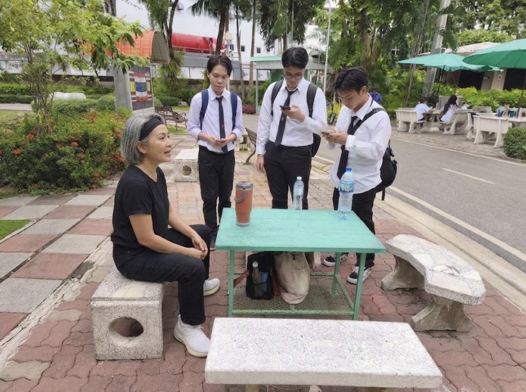
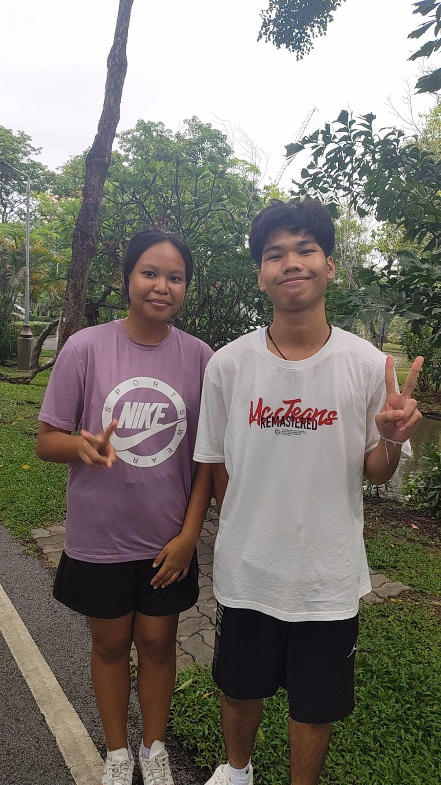
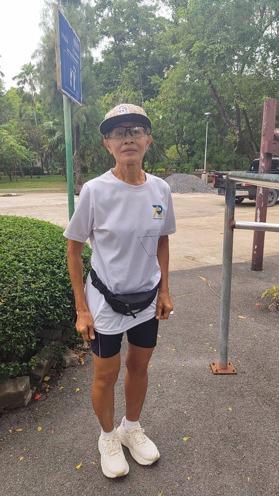
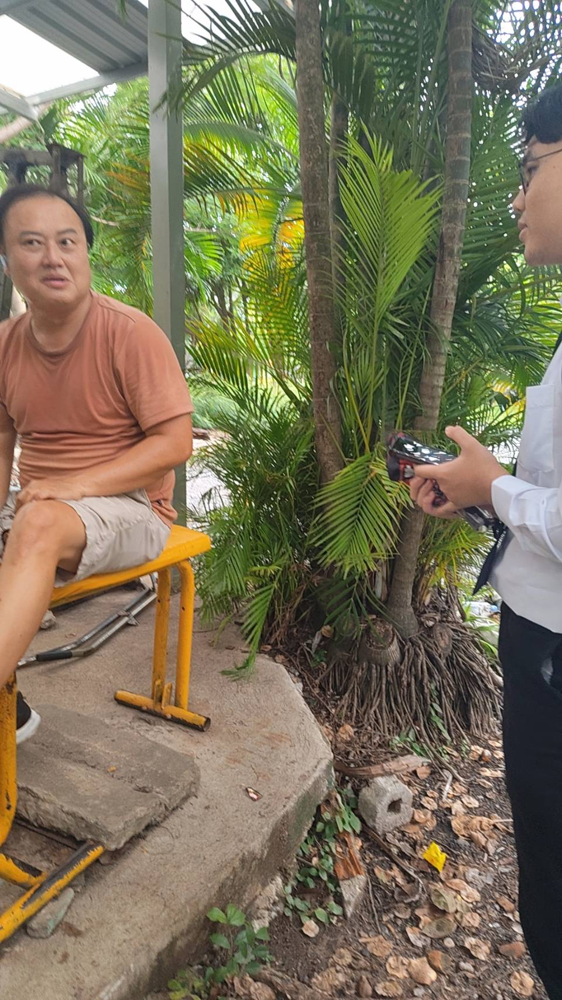
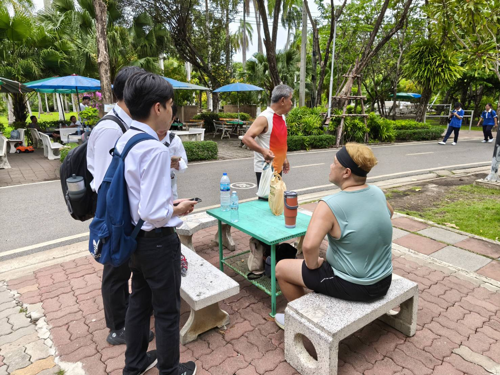

# *User Persona*

เขาคือใคร

กลุ่มนักเรียนหญิงจากโรงเรียนนาหลวง (ชั้น ม.5)

สาเหตุการมาสวนสาธารณะ

มาทำงานกลุ่มและนั่งทำงานร่วมกับเพื่อนๆ

วัตถุประสงค์

ใช้พื้นที่บรรยากาศดีและอากาศเย็นสบายในการนั่งทำงานกลุ่ม

ข้อดี - ข้อเสียของสวน

ข้อดี: บรรยากาศสงบ อากาศเย็นสบาย เหมาะกับการนั่งทำงาน และเดินทางได้สะดวก

ข้อเสีย: ปัญหากลิ่นรบกวนจากตัวตัวเงินตัวทอง และพื้นที่นั่ง/ศาลานั่งพักมีไม่เพียงพอ

สิ่งที่อยากให้ปรับปรุง

เพิ่มศาลาหรือพื้นที่นั่งพักขนาดใหญ่ขึ้น เพื่อรองรับการนั่งทำงานกลุ่ม
จัดการเรื่องกลิ่นรบกวนจากสัตว์ในสวน

เขาคือใคร

พนักงานร้านสุกี้ตี๋น้อย ที่ได้วันหยุดพักผ่อน มาพร้อมกับภรรยาและลูก
พักอาศัยอยู่แถวซอยประชาอุทิศ 33 แยก 12 และเดินทางมาด้วยรถมอเตอร์ไซค์ส่วนตัว

สาเหตุการมาสวนสาธารณะ

ตรงกับวันหยุดจากการทำงานพอดี
สภาพอากาศดี โปร่งสบาย เหมาะกับการออกมาข้างนอก

วัตถุประสงค์

พาลูกออกมาวิ่งเล่นออกกำลังกายและคลายเหงา เนื่องจากปกติน้องจะอยู่แต่ในห้อง

ข้อดี - ข้อเสียของสวน

ข้อดี: สวนมีความกว้างขวาง บรรยากาศดี เดินทางมาสะดวก (ขี่มอเตอร์ไซค์มาแป๊บเดียวถึง) และมีความปลอดภัยสำหรับพาลูกมาเดินเล่น
ข้อเสีย: ไม่พบข้อเสียหรือจุดที่ไม่ชอบ ผู้ตอบสัมภาษณ์รู้สึกพึงพอใจและสบายใจกับการมาใช้บริการ

เขาคือใคร 
คุณชโร (อายุ 55 ปี)
อาชีพ: ทำธุรกิจขายมัจฉะเดลิเวอรี (ร้าน "Zen Ai Matcha" ย่านประชาอุทิศ 34) ในช่วงวันเสาร์-อาทิตย์

สาเหตุการมาสวนสาธารณะ

มาเดินออกกำลังกายเป็นเพื่อนคุณพ่อ โดยมักจะมาเป็นประจำในช่วงวันอังคารถึงวันพฤหัสบดี

วัตถุประสงค์

เพื่อออกกำลังกาย ดูแลสุขภาพของตนเองและคุณพ่อ รวมถึงมาผ่อนคลายความเครียด

ข้อดี - ข้อเสียของสวน

ข้อดี: อยู่ใกล้บ้าน เดินทางสะดวก มีพื้นที่ให้ออกกำลังกาย และช่วยให้สุขภาพกายและสุขภาพจิตดีขึ้น
ข้อเสีย:

ที่จอดรถมีจำนวนน้อยเกินไป

ขาดหลบฝนหรือที่ร่มเวลามีฝนตก

ถนน/ทางเข้าหน้าสวนมีความเสี่ยงต่ออุบัติเหตุ โดยเฉพาะผู้สูงอายุที่เดินช้า อาจโดนรถจักรยานยนต์ชนได้ง่าย

การจราจรหน้าสวนติดขัดเวลาที่มีรถกู้ภัยหรือรถพยาบาลมารับผู้ป่วย

สิ่งที่อยากให้ปรับปรุง

อยากให้มีเจ้าหน้าที่ดูแลรักษาความปลอดภัยประจำจุดตลอด 24 ชั่วโมง หรือดูแลครอบคลุมพื้นที่สุ่มเสี่ยง
ปรับปรุงเรื่องความปลอดภัยรอบขอบสระน้ำ เช่น ทำรั้ว/กั้นขอบให้สูงขึ้น เพื่อป้องกันเด็กหรือผู้สูงอายุตกน้ำ
จัดให้มีหน่วยพยาบาลหรือจุดปฐมพยาบาลเบื้องต้นประจำภายในสวน

เขาคือใคร

นักศึกษามหาวิทยาลัย (คณะวิทยาศาสตร์ สาขาเคมี) ชื่อ คุณส้มโอ (อายุ 21 ปี) และคุณอ้น (อายุ 20 ปี)

สาเหตุการมาสวนสาธารณะ

มาใช้งานค่อนข้างบ่อยประมาณ 3–4 วันต่อสัปดาห์
ที่ตั้งของสวนอยู่ใกล้กับมหาวิทยาลัย ทำให้เดินทางมาสะดวก

วัตถุประสงค์

มาพักผ่อน นั่งเล่น เดินเล่น และนั่งทำการบ้านหลังเลิกเรียน

ข้อดี - ข้อเสียของสวน

ข้อดี: สวนมีความเป็นธรรมชาติ ร่มเย็น และขนาดกำลังพอดี ไม่ต้องเดินไกลเหมือนสวนอื่นๆ
ข้อเสีย: ห้องน้ำมีความสกปรกและมีกลิ่นเหม็นรบกวน เนื่องจากมีคนมาใช้งานเป็นจำนวนมาก

สิ่งที่อยากให้ปรับปรุง

เพิ่มจำนวนม้านั่งตามจุดต่างๆ ให้เพียงพอ เนื่องจากเวลานั่งพักตามจุดที่เดินไปไกลๆ หรือช่วงคนเยอะ มักจะไม่ค่อยมีที่นั่ง
ปรับปรุงเรื่อง hygiene และความสะอาดของห้องน้ำ

เขาคือใคร

คุณป้านุช (อายุ 70 ปี)

ผู้ใช้บริการสวนสาธารณะเป็นประจำทุกวัน (วันจันทร์–วันศุกร์)

สาเหตุการมาสวนสาธารณะ

ต้องการสถานที่สำหรับเดินออกกำลังกายและพักผ่อนหย่อนใจเป็นประจำ

วัตถุประสงค์

เดินออกกำลังกาย รับอากาศบริสุทธิ์เพื่อความสดชื่น และดูแลสุขภาพ

ข้อดี - ข้อเสียของสวน

ข้อดี: บรรยากาศร่มรื่น สดชื่น เหมาะแก่การออกกำลังกาย สวนมีขนาดกำลังดี ไม่กว้างเกินไป (ระยะทางเดินประมาณ 1,100 เมตร)

ข้อเสีย:
ม้านั่ง/เก้าอี้พักผ่อนมีจำนวนน้อยเกินไป
เครื่องออกกำลังกายมีจำนวนน้อย ไม่เพียงพอ
พื้นที่สวนหย่อมบางจุดยังมีความสกปรก มีขยะทิ้งไว้
บรรยากาศบริเวณห้องน้ำค่อนข้างมืด ทึบ เปลี่ยว และดูเป็นธรรมชาติเกินไปจนน่ากลัว

สิ่งที่อยากให้ปรับปรุง

เพิ่มจำนวนม้านั่งและเครื่องออกกำลังกายให้เพียงพอ
เพิ่มการดูแลความสะอาด ขยะ และการกวาดเช็ดถูในบริเวณสวนหย่อม
เพิ่มเจ้าหน้าที่ดูแลความปลอดภัยให้ทั่วถึง
ปรับปรุงแสงสว่าง สภาพแวดล้อม และโทนสีบริเวณห้องน้ำไม่ให้ดูมืดทึบหรือเปลี่ยว

เขาคือใคร

พี่ เอ็ม

ผู้ใช้บริการสวนสาธารณะเป็นประจำ ประมาณ 4–5 วันต่อสัปดาห์

สาเหตุการมาสวนสาธารณะ

อยู่ใกล้บ้าน เดินทางสะดวก
มีบรรยากาศร่มรื่น สภาพแวดล้อมเป็นธรรมชาติ

วัตถุประสงค์

มาพักผ่อนหย่อนใจ และใช้อุปกรณ์สิ่งอำนวยความสะดวกในสวน

ข้อดี - ข้อเสียของสวน

ข้อดี: บรรยากาศร่มรื่น เป็นธรรมชาติ อุปกรณ์สิ่งอำนวยความสะดวกและห้องน้ำมีความสะอาด ครบถ้วนสมบูรณ์ รองรับคนได้หลากหลาย
ข้อเสีย: ลานจอดรถสำหรับรถยนต์ขนาดใหญ่มีความคับแคบ และมีจำนวนซองจอดน้อยเกินไป

สิ่งที่อยากให้ปรับปรุง

ขยายหรือปรับปรุงพื้นที่จอดรถสำหรับรถยนต์ขนาดใหญ่ให้กว้างขวางและรองรับได้มากขึ้น

เขาคือใคร

คุณบิ๊ก อายุ 47 ปี

มาใช้บริการสวนสาธารณะเป็นประจำเกือบทุกวันในช่วงเย็น

สาเหตุการมาสวนสาธารณะ

มาออกกำลังกาย (วิ่ง) และซึมซับบรรยากาศธรรมชาติที่มีต้นไม้ร่มรื่น ต่างจากคอนโดที่พักอาศัยซึ่งไม่ค่อยมีต้นไม้
ได้พบปะเพื่อนๆ ที่มาออกกำลังกายด้วยกัน

วัตถุประสงค์

มาวิ่งออกกำลังกาย ยืดเส้นยืดสาย และผ่อนคลายในบรรยากาศธรรมชาติ

ข้อดี - ข้อเสียของสวน

ข้อดี: บรรยากาศร่มรื่น มีต้นไม้เยอะ และมีอุปกรณ์สำหรับยืดเส้นยืดสายที่ดีกว่าที่บ้านหรือคอนโด
ข้อเสีย: ห้องน้ำชายมีกลิ่นเหม็นรบกวน

สิ่งที่อยากให้ปรับปรุง

อยากให้เพิ่มอุปกรณ์ออกกำลังกาย โดยเฉพาะอุปกรณ์สำหรับยืดเส้นและคลายกล้ามเนื้อ

