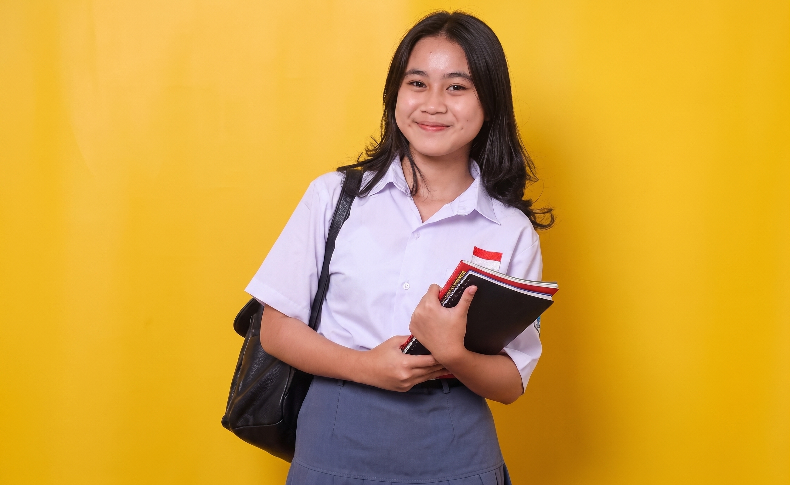

# User Persona 

## Persona 1: "น้องฝ้าย" 
*กลุ่มวัยรุ่น/นักศึกษา*

### Core Profile
- อายุ 18 ปี 
- นักเรียน
- มาสวนบ่อย 3–4 วัน/สัปดาห์ ช่วงหลังเลิกเรียน
- โรงเรียนอยู่ใกล้สวนเดินทางสะดวก

### Behavior
- มาทำงานกลุ่มหรือทำการบ้านกับเพื่อน
- นั่งเล่น พักผ่อนหลังเลิกเรียน
- เลือกสวนนี้เพราะบรรยากาศร่มรื่น ขนาดกำลังดี ไม่ต้องเดินไกลเหมือนสวนอื่น

### Pain Point
- ที่นั่ง/ศาลาไม่เพียงพอ โดยเฉพาะสำหรับนั่งเป็นกลุ่ม
- ห้องน้ำสกปรก มีกลิ่นเหม็น (เพราะมีคนใช้งานจำนวนมาก)

### User Insights (Needs & Goals)
- อยากได้พื้นที่นั่งทำงานกลุ่มขนาดใหญ่ขึ้น พร้อมโต๊ะ/ศาลา
- อยากให้ห้องน้ำสะอาดขึ้น รองรับการใช้งานที่ถี่
- อยากได้พื้นที่ที่เงียบพอจะโฟกัสทำงาน แต่ยังมีบรรยากาศธรรมชาติ

---

## Persona 2: "คุณเอกชัย" 
*กลุ่มวัยทำงาน/ครอบครัว*

### Core Profile
- อายุ 41 ปี 
- มนุษย์เงินเดือน
- อาศัยในคอนโด เดินทางด้วยมอเตอร์ไซค์หรือรถยนต์
- มาสวนช่วงเย็นหลังเลิกงานหรือวันหยุด เกือบทุกวัน (4–5 วัน/สัปดาห์)

### Behavior
- มาวิ่งออกกำลังกาย พบปะเพื่อนที่มาออกกำลังกายด้วยกัน
- บางครั้งพาลูก/ครอบครัวมาเดินเล่นคลายเหงา
- ใช้อุปกรณ์ยืดเส้นยืดสาย

### Pain Point
- ที่จอดรถ (โดยเฉพาะรถขนาดใหญ่) มีจำนวนน้อย คับแคบ
- ห้องน้ำชายมีกลิ่นเหม็นรบกวน
- อุปกรณ์ออกกำลังกาย/ยืดเส้นมีไม่เพียงพอ

### User Insights (Needs & Goals)
- อยากให้มีที่จอดรถกว้างขวางเพียงพอ โดยเฉพาะช่วงเย็นที่คนเยอะ
- อยากให้ลูกได้ออกมาข้างนอก ไม่อยู่แต่ในห้อง/คอนโด
- อยากได้อุปกรณ์ออกกำลังกายที่ครบและสะอาดมากขึ้น

---

## Persona 3: "คุณสมศรี" 
*กลุ่มผู้สูงอายุ*

### Core Profile
- อายุ 62 ปี 
- ทำธุรกิจส่วนตัว
- มาสวนเป็นประจำแทบทุกวัน (จันทร์–ศุกร์ หรือ อังคาร–พฤหัสบดี)
- อาศัยใกล้สวน เดินทางด้วยการเดิน

### Behavior
- มาเดินออกกำลังกายเป็นหลัก บางครั้งมาเป็นเพื่อนพ่อแม่/ญาติสูงอายุ
- ใช้เวลาส่วนใหญ่ไปกับการเดินระยะทางรอบสวน (ประมาณ 1,100 เมตร)
- ดูแลสุขภาพกายและใจผ่านการออกกำลังกายเบาๆ

### Pain Point
- ถนน/ทางเข้าหน้าสวนเสี่ยงอุบัติเหตุ เดินช้าอาจโดนมอเตอร์ไซค์ชน
- ไม่มีรั้ว/ขอบกั้นสระน้ำสูงพอ เสี่ยงตกน้ำ
- ไม่มีจุดปฐมพยาบาล/หน่วยพยาบาลในสวน
- ม้านั่ง/เครื่องออกกำลังกายไม่เพียงพอ
- ห้องน้ำมืด ทึบ เปลี่ยว ดูน่ากลัว

### User Insights (Needs & Goals)
- อยากให้มีเจ้าหน้าที่ดูแลความปลอดภัยประจำจุดตลอดเวลา หรือครอบคลุมจุดเสี่ยง
- อยากให้ปรับปรุงความปลอดภัยรอบขอบสระน้ำ
- อยากให้มีจุดปฐมพยาบาลเบื้องต้นในสวน
- อยากให้ปรับปรุงแสงสว่างและบรรยากาศห้องน้ำไม่ให้ดูมืดทึบ/เปลี่ยว
- อยากให้เพิ่มม้านั่งและเครื่องออกกำลังกายให้เพียงพอ
