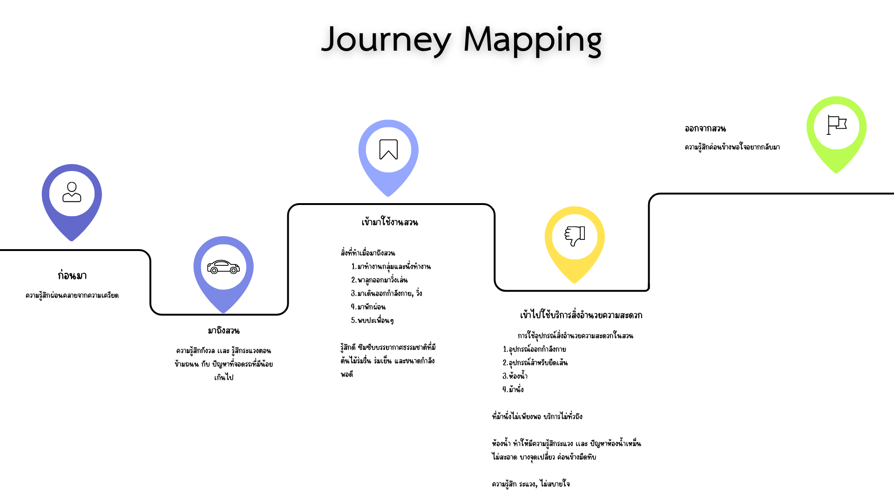

# User Journey Map
## Stage 1: Before Visit (ก่อนมาสวน)

### User Actions (สิ่งที่ผู้ใช้ทำ)

- วางแผนมาสวน

### Emotions (ความรู้สึก)

- รู้สึกผ่อนคลายจากความเครียด

## Stage 2: Arrival (เมื่อมาถึงสวน)

### User Actions (สิ่งที่ผู้ใช้ทำ)

- ขับรถหรือเดินทางมา
- หาที่จอดรถ
- เข้าสวน

### Emotions (ความรู้สึก)

- กังวลและรู้สึกระแวงขณะข้ามถนน

### Pain Points (ปัญหาที่พบ)

- ที่จอดรถไม่เพียงพอ
- การจราจรหนาแน่นและการข้ามถนนอันตราย

## Stage 3: Primary Activities (ทำกิจกรรมหลัก)

### User Actions (สิ่งที่ผู้ใช้ทำ)

- ทำงานกลุ่ม
- ออกกำลังกาย เช่น วิ่ง เดิน และยืดเส้น
- นั่งพักผ่อน
- พาลูกเดินเล่น
- ใช้อุปกรณ์ออกกำลังกาย

### Emotions (ความรู้สึก)

- สดชื่น
- ผ่อนคลาย
- พึงพอใจ
- ดีใจ

### Positive Experiences (ประสบการณ์ที่ดี)

- บรรยากาศมีร่มเงาและเย็นสบาย
- อยู่ใกล้บ้าน เดินทางสะดวก
- สามารถนัดเพื่อนมารวมกลุ่มได้
- ธรรมชาติสวยงาม
- พื้นที่มีความปลอดภัย
- ขนาดพื้นที่เหมาะสมกับการใช้งาน

### Pain Points (ปัญหาที่พบ)

- บริเวณบางจุดเปลี่ยวและไม่ปลอดภัย
- อุปกรณ์ออกกำลังกายมีไม่ครบ
- มีกลิ่นรบกวนจากสัตว์ในบางพื้นที่
- เส้นทางบางจุดไม่เรียบ

## Stage 4: Facilities Usage (ใช้สิ่งอำนวยความสะดวก)

### User Actions (สิ่งที่ผู้ใช้ทำ)

- หาที่นั่ง
- ใช้ห้องน้ำ
- เติมน้ำดื่ม
- หาพื้นที่หลบฝน

### Emotions (ความรู้สึก)

- ระแวง
- รู้สึกไม่สบายใจหากสิ่งอำนวยความสะดวกมีปัญหา
- ประหม่า

### Touchpoints (จุดสัมผัส)

- ห้องน้ำ
- ที่นั่งหรือศาลา
- จุดเติมน้ำดื่ม
- พื้นที่หลบฝน

### Pain Points (ปัญหาที่พบ)

- ห้องน้ำสกปรกและมีกลิ่นเหม็น
- ที่นั่งไม่เพียงพอ โดยเฉพาะสำหรับกลุ่มคน
- ไม่มีพื้นที่กันฝน
- บริเวณห้องน้ำเปลี่ยวหรือไม่สว่าง

### Critical Issues (ประเด็นสำคัญ)

- **ความสะอาด:** ส่งผลต่อสุขอนามัยและความประทับใจ
- **ที่นั่ง:** ส่งผลต่อการพักผ่อนและความพึงพอใจ
- **ความปลอดภัย:** ส่งผลต่อการกลับมาใช้บริการซ้ำ

## Stage 5: Departure (ออกจากสวน)

### User Actions (สิ่งที่ผู้ใช้ทำ)

- ออกจากสวน

### Emotions (ความรู้สึก)

- พึงพอใจ
- อยากกลับมาอีก

## Overall Sentiment (ความรู้สึกโดยรวม)

ภาพรวมดี แม้จะมีปัญหาย่อยบางประการ

