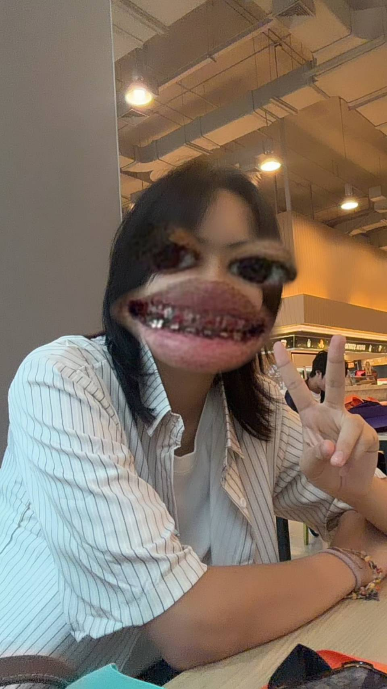

#### เพื่อนมีชื่อว่า อังเปา ชื่อจริง ณธรรศ ลิ้มสวัสดิ์

**เหตุผลที่เพื่อนทำไมถึงเลือกเรียนในสายนี้ เพราะอะไร**  
อังเปาเลือกเรียนสาย IT เพราะเขามองว่าเป็นความรู้ที่สามารถนำไปใช้ได้จริงในหลายด้าน ไม่ว่าจะเป็นการทำโปรแกรม เว็บไซต์ ระบบ หรือเทคโนโลยีต่าง ๆ จึงเชื่อว่าสายนี้สามารถต่อยอดได้กว้างและมีโอกาสมากมายในอนาคต  

**คิดว่าเรื่องนี้ท้าทายที่สุดสำหรับคุณคืออะไร และเพราะอะไร**  
สำหรับสิ่งที่อังเปา มองว่าท้าทายที่สุด คือการทำงานเป็นทีม เนื่องจากแต่ละคนมีความคิดเห็นที่แตกต่างกัน การเรียนรู้ที่จะฟังและหาวิธีทำงานร่วมกันจึงเป็นเรื่องสำคัญและท้าทายสำหรับเขา  

**คิดว่าจุดที่อยากพัฒนาของตัวเองคืออะไร เพราะอะไร**  
อังเปาอยากพัฒนาความกล้าแสดงออก โดยเฉพาะเวลาที่ต้องอยู่กับคนที่ไม่คุ้นเคย ทำให้อังเปาเชื่อว่าการเปิดใจและกล้าแสดงความคิดเห็นมากขึ้นจะช่วยให้การทำงานร่วมกับคนอื่นมีประสิทธิภาพมากขึ้น  

**คิดว่าตัวเองเป็นคนเข้าสังคมง่ายหรือต้องใช้เวลาในการปรับตัว และเพราะอะไร**  
ในเรื่องการเข้าสังคม อังเปา มองว่าตัวเองต้องใช้เวลาปรับตัว ตอนแรกอาจจะไม่ค่อยพูดกับคนที่ไม่รู้จัก แต่เมื่อได้ทำความรู้จักกันแล้ว ก็สามารถเข้ากับคนอื่นได้ตามปกติ 

**มีความฝันอะไรที่ยังอยากทำให้สำเร็จมั้ย เพราะอะไรถึงอยากทำ**  
ความฝันของอังเปาคือการได้ทำงานที่ตัวเองชอบและสามารถทำไปได้นาน อังเปา เชื่อว่าการได้ทำงานที่สนใจจะทำให้มีแรงบันดาลใจในการพัฒนาตัวเองอยู่เสมอ

***อังเปา social link***

ig: https://www.instagram.com/2403up/

*** อังเปา image ***

# อิน #
*เขียนโดย : @github-norrawit45-sys*

  

* **Github :** SarudaS https://github.com/SarudaS
* **IG :** srdxw_ https://www.instagram.com/srdxw_

- ชื่อ - นามสกุล : นางสาวศรุดา  สุวรรณกล่อม  
ชื่อเล่น : อิน  
- ทำไมถึงเลือกเรียนในสายนี้ เพราะอะไร : ความชอบในการเขียนโค้ดและlogic  
- คิดว่าเรื่องนี้ท้าทายที่สุดสำหรับคุณคืออะไร และเพราะอะไร : เพิ่มความรู้ความเข้าใจให้เท่าทันเทคโนโลยี  
- คิดว่าจุดที่อยากพัฒนาของตัวเองคืออะไร เพราะอะไร : ความรู้ในสายบริหารและการเงิน เพราะคิดวาเราจะมีความถนัดเพียงแค่สายITในปัจจุบันไม่พอต้องอาศัยความเข้าใจในธุรกิจด้วย  
- คิดว่าตัวเองเป็นคนเข้าสังคมง่ายหรือต้องใช้เวลาในการปรับตัว และเพราะอะไร : คิดว่าเราเป็นคนที่ต้องใช้เวลาในการปรับตัวเพื่อเข้าสังคม เพราะต้องใช้เวลาในการปรับตัวกับสังคมใหม่ๆที่ไม่คุ้นชิน  
- มีความฝันอะไรที่ยังอยากทำให้สำเร็จมั้ย เพราะอะไรถึงอยากทำ : อยากทำงานสาย Software Engineering แบบremote เพราะการทำงานแบบremoteสามารถบริหารจัดการเวลาได้อย่างมีประสิทธิภาพ   