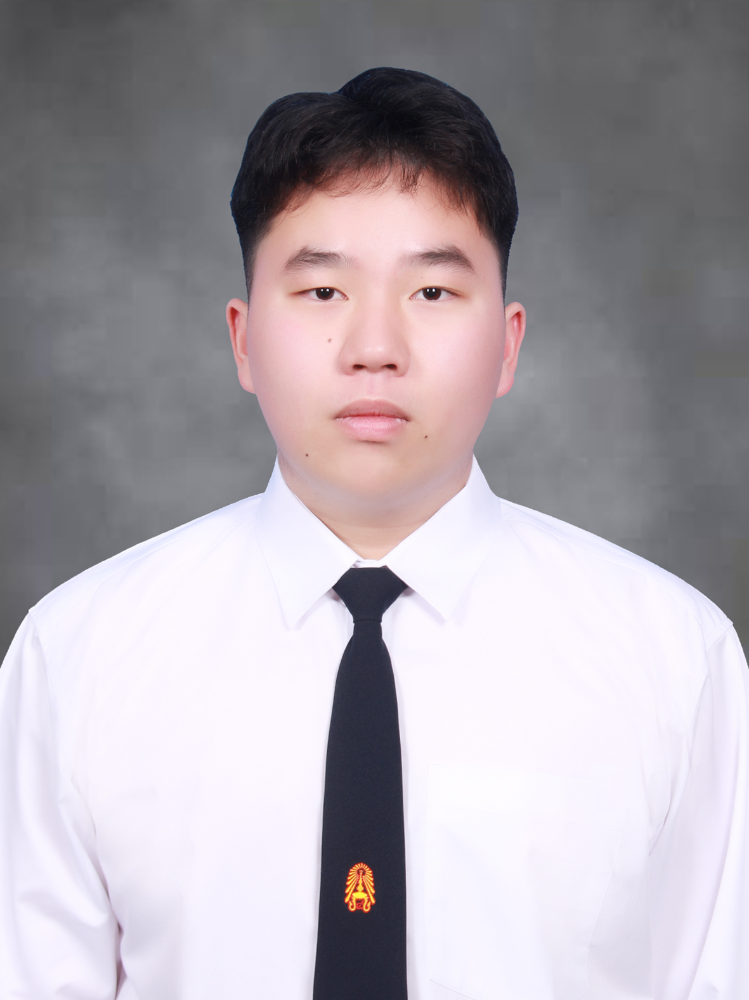
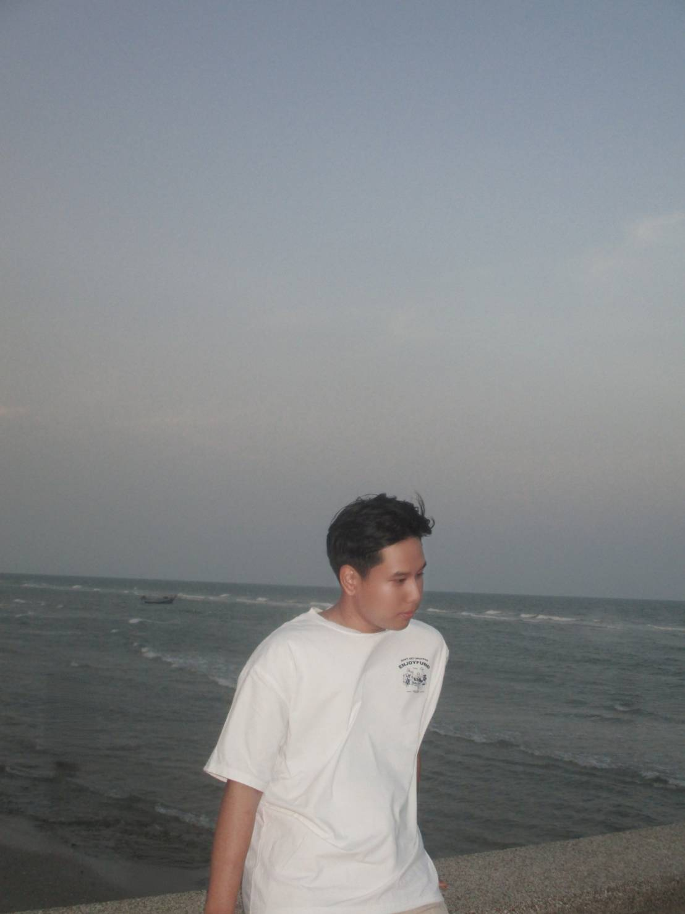
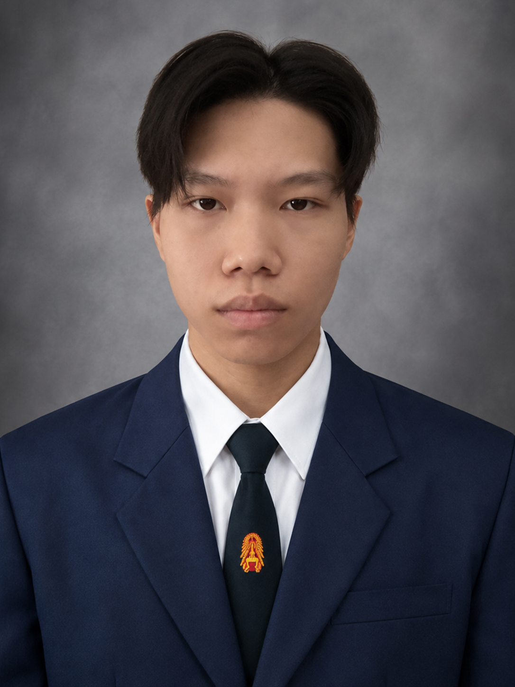
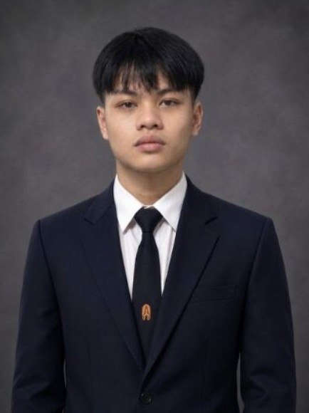

# GUGUGAGA Team 👨🏻‍🦲

## ที่มาของชื่อทีม

ชื่อทีม **GUGUGAGA** มาจากการตกลงกันในทีนผ่าน issue ได้ผลโหวต 4/6

---

## สมาชิกทีม

### อังเปา — ณธรรศ ลิ้มสวัสดิ์
*เขียนโดย : ธนาพิสิษฐ์ อ่อนสร้อย github:Aomtana0070*

**เหตุผลที่เพื่อนทำไมถึงเลือกเรียนในสายนี้ เพราะอะไร**  
อังเปาเลือกเรียนสาย IT เพราะเขามองว่าเป็นความรู้ที่สามารถนำไปใช้ได้จริงในหลายด้าน ไม่ว่าจะเป็นการทำโปรแกรม เว็บไซต์ ระบบ หรือเทคโนโลยีต่าง ๆ จึงเชื่อว่าสายนี้สามารถต่อยอดได้กว้างและมีโอกาสมากมายในอนาคต

**คิดว่าเรื่องนี้ท้าทายที่สุดสำหรับคุณคืออะไร และเพราะอะไร**  
สำหรับสิ่งที่อังเปา มองว่าท้าทายที่สุด คือการทำงานเป็นทีม เนื่องจากแต่ละคนมีความคิดเห็นที่แตกต่างกัน การเรียนรู้ที่จะฟังและหาวิธีทำงานร่วมกันจึงเป็นเรื่องสำคัญและท้าทายสำหรับเขา

**คิดว่าจุดที่อยากพัฒนาของตัวเองคืออะไร เพราะอะไร**  
อังเปาอยากพัฒนาความกล้าแสดงออก โดยเฉพาะเวลาที่ต้องอยู่กับคนที่ไม่คุ้นเคย ทำให้อังเปาเชื่อว่าการเปิดใจและกล้าแสดงความคิดเห็นมากขึ้นจะช่วยให้การทำงานร่วมกับคนอื่นมีประสิทธิภาพมากขึ้น

**คิดว่าตัวเองเป็นคนเข้าสังคมง่ายหรือต้องใช้เวลาในการปรับตัว และเพราะอะไร**  
ในเรื่องการเข้าสังคม อังเปา มองว่าตัวเองต้องใช้เวลาปรับตัว ตอนแรกอาจจะไม่ค่อยพูดกับคนที่ไม่รู้จัก แต่เมื่อได้ทำความรู้จักกันแล้ว ก็สามารถเข้ากับคนอื่นได้ตามปกติ

**มีความฝันอะไรที่ยังอยากทำให้สำเร็จมั้ย เพราะอะไรถึงอยากทำ**  
ความฝันของอังเปาคือการได้ทำงานที่ตัวเองชอบและสามารถทำไปได้นาน อังเปา เชื่อว่าการได้ทำงานที่สนใจจะทำให้มีแรงบันดาลใจในการพัฒนาตัวเองอยู่เสมอ

***อังเปา social link***

IG: https://www.instagram.com/2403up/

---

### อิน — นางสาวศรุดา สุวรรณกล่อม
*เขียนโดย : @github-norrawit45-sys*

* **Github :** SarudaS https://github.com/SarudaS
* **IG :** srdxw_ https://www.instagram.com/srdxw_

- ชื่อ - นามสกุล : นางสาวศรุดา สุวรรณกล่อม
- ชื่อเล่น : อิน
- ทำไมถึงเลือกเรียนในสายนี้ เพราะอะไร : ความชอบในการเขียนโค้ดและ logic
- คิดว่าเรื่องนี้ท้าทายที่สุดสำหรับคุณคืออะไร และเพราะอะไร : เพิ่มความรู้ความเข้าใจให้เท่าทันเทคโนโลยี
- คิดว่าจุดที่อยากพัฒนาของตัวเองคืออะไร เพราะอะไร : ความรู้ในสายบริหารและการเงิน เพราะคิดวาเราจะมีความถนัดเพียงแค่สาย IT ในปัจจุบันไม่พอต้องอาศัยความเข้าใจในธุรกิจด้วย
- คิดว่าตัวเองเป็นคนเข้าสังคมง่ายหรือต้องใช้เวลาในการปรับตัว และเพราะอะไร : คิดว่าเราเป็นคนที่ต้องใช้เวลาในการปรับตัวเพื่อเข้าสังคม เพราะต้องใช้เวลาในการปรับตัวกับสังคมใหม่ ๆ ที่ไม่คุ้นชิน
- มีความฝันอะไรที่ยังอยากทำให้สำเร็จมั้ย เพราะอะไรถึงอยากทำ : อยากทำงานสาย Software Engineering แบบ remote เพราะการทำงานแบบ remote สามารถบริหารจัดการเวลาได้อย่างมีประสิทธิภาพ

---

### ออม — ธนาพิสิษฐ์ อ่อนสร้อย

**เหตุผลที่เพื่อนทำไมถึงเลือกเรียนในสายนี้ เพราะอะไร**  
ออมเลือกเรียนสาย IT เพราะเขาชอบการสร้างหรือการพัฒนาสิ่งของต่าง ๆ และตอนมัธยมออมได้มีโอกาสไปแข่งสร้างเกมทำให้คิดว่านี่เป็นตัวตนของเขา

**คิดว่าเรื่องนี้ท้าทายที่สุดสำหรับคุณคืออะไร และเพราะอะไร**  
สำหรับสิ่งที่ออม มองว่าท้าทายที่สุด คือการกล้าแสดงออกและการสื่อสารกับคนอื่นเพราะเขาเป็นคนไม่ค่อยกล้าพูด

**คิดว่าจุดที่อยากพัฒนาของตัวเองคืออะไร เพราะอะไร**  
ออมอยากพัฒนาการเข้าสังคมให้ดีขึ้น เพราะรู้สึกว่าตัวเองเป็นคนพูดไม่เก่งและไม่ค่อยกล้าแสดงออกในกิจกรรมต่าง ๆ

**คิดว่าตัวเองเป็นคนเข้าสังคมง่ายหรือต้องใช้เวลาในการปรับตัว และเพราะอะไร**  
ในเรื่องการเข้าสังคม ออม มองว่าตัวเองต้องใช้เวลาปรับตัวค่อนข้างนาน เพราะออมไม่ค่อยกล้าพูดหรือไม่กล้าแสดงออก

**มีความฝันอะไรที่ยังอยากทำให้สำเร็จมั้ย เพราะอะไรถึงอยากทำ**  
ความฝันของออม คืออยากลองทำคาเฟ่คอมพิวเตอร์ เพราะตัวออมเป็นคนชอบกินกาแฟ และชอบนั่งคาเฟ่

***ออม social link***

FB: https://www.facebook.com/tanapisit.onsroi/

IG: https://www.instagram.com/tanapisit_onsroi.real/

Git HUB: https://github.com/Aomtana0070

---

### โชกุน — นายรวิชญ์ สังข์ภิรมย์
*เขียนโดย : github-SarudaS*

 

**social link**  
**Github :** norrawit45-sys https://github.com/norrawit45-sys 
**IG :** nrw._xprex https://www.instagram.com/nrw._xprex

**ทำไมถึงเลือกเรียนในสายนี้ เพราะอะไร**  
ความชอบคอม เพราะชอบเรื่องฮาร์ดแวร์มาก่อนแล้วมารู้จักซอฟต์แวร์ทีหลังเลยเรียนรู้มาเรื่อย ๆ จนเลือกเข้ามาเรียนในสายนี้จริงจัง

**คิดว่าเรื่องนี้ท้าทายที่สุดสำหรับคุณคืออะไร และเพราะอะไร**  
การทำงานในสาย IT เพราะว่า AI มันเก่งขึ้นเรื่อย ๆ เลยไม่รู้จะไปจบที่ตรงไหนด้วยความคิดผู้ประกอบการที่จะใช้ AI ทำงานแทนคนด้วย

**คิดว่าจุดที่อยากพัฒนาของตัวเองคืออะไร เพราะอะไร** 
ความคิดทางด้านธุรกิจและการลงทุน เพราะมีความสนใจในระดับหนึ่งอย่างการซื้อหุ้นปันผลเป็นต้น

**คิดว่าตัวเองเป็นคนเข้าสังคมง่ายหรือต้องใช้เวลาในการปรับตัว และเพราะอะไร**  
ต้องใช้เวลาปรับตัว เพราะอย่างเข้ามหาลัยก็ต้องหาเพื่อนใหม่ เปลี่ยนสังคมใหม่ยังไม่คุ้นชินกัน

**มีความฝันอะไรที่ยังอยากทำให้สำเร็จมั้ย เพราะอะไรถึงอยากทำ** 
อิสรภาพทางการเงิน เพราะอยากมีรายได้ที่มั่นคง สามารถดูแลตัวเองและคนในครอบครัวได้โดยไม่ต้องกังวล

---

### จอห์น — จอห์น ตั้น

**ทำไมถึงเลือกเรียนในสายนี้ เพราะอะไร**  
เลือกเรียนสายนี้เพราะมองว่า IT เป็นสายที่มีโอกาสพัฒนาและต่อยอดได้หลากหลาย จึงอยากเรียนรู้และนำความรู้ไปสร้างผลงานหรือพัฒนาสิ่งที่สามารถแก้ปัญหาในชีวิตจริงได้ในอนาคต

**คิดว่าเรื่องนี้ท้าทายที่สุดสำหรับคุณคืออะไร และเพราะอะไร**  
สิ่งที่ท้าทายที่สุดคือการเริ่มทำอะไรสักอย่างที่ไม่เคยทำ เพราะการเริ่มต้นอะไรซักอย่างโดยที่ไม่มีประสบการณ์มาก่อนเลย ทำให้ไม่รู้ว่าควรเริ่มจากตรงไหนและอาจเกิดความผิดพลาดได้ง่าย จนทำให้ไม่อยากทำสิ่งนั้นต่ออีก

**คิดว่าจุดที่อยากพัฒนาของตัวเองคืออะไร เพราะอะไร**  
อยากพัฒนาการสื่อสารให้ดียิ่งขึ้น เพราะเป็นทักษะที่จำเป็นมากในการทำงานจริงและการทำงานร่วมกับผู้อื่น ถึงแม้จะมีความสามารถที่ดี แต่สื่อสารได้ไม่ดีก็อาจทำให้ทำงานได้ยาก จึงอยากฝึกให้สามารถสื่อสารได้อย่างชัดเจนและมั่นใจมากขึ้น

**คิดว่าตัวเองเป็นคนเข้าสังคมง่ายหรือต้องใช้เวลาในการปรับตัว และเพราะอะไร**  
เป็นคนต้องใช้เวลาในการปรับตัวซักระยะ เพราะโดยส่วนตัวเป็นคนที่อยู่กับสังคมเดิมตลอด ไม่ค่อยได้เจอกลุ่มคนใหม่ๆ มาก ถ้าต้องย้ายไปอยู่สังคมใหม่ก็อาจต้องใช้เวลาในการเข้ากับคนใหม่ ๆ

**มีความฝันอะไรที่ยังอยากทำให้สำเร็จมั้ย เพราะอะไรถึงอยากทำ**  
อยากทำธุรกิจเป็นของตัวเองให้สำเร็จ เพราะอยากมีรายได้ที่สูงและมีอิสระทางการเงิน สร้างรายได้จากสิ่งที่ตัวเองเป็นคนคิดและลงมือทำด้วยตัวเอง

***จอห์น social link***

IG: https://www.instagram.com/cchhntxn/

---

### ฮิว — วัชชิรพงษ์ ธนโชติคณาทิวัตถ์

**ทำไมถึงเลือกเรียนในสายนี้ เพราะอะไร**  
เลือกเรียน IT เพราะส่วนตัวชอบเรื่องเทคโนโลยีอยู่แล้ว แล้วก็คิดว่าสายนี้สามารถต่อยอดไปทำงานได้หลายด้าน และน่าจะมีโอกาสเติบโตในอนาคตด้วย

**คิดว่าเรื่องนี้ท้าทายที่สุดสำหรับคุณคืออะไร และเพราะอะไร**  
คิดว่าเป็นเรื่องการทำงานเป็นทีม เพราะแต่ละคนไม่เคยรู้จักกันมาก่อน ต้องมาปรับตัวและแบ่งงานกัน ซึ่งแต่ละคนก็มีความคิดและวิธีทำงานไม่เหมือนกัน เลยคิดว่าค่อนข้างท้าทาย

**คิดว่าจุดที่อยากพัฒนาของตัวเองคืออะไร เพราะอะไร**  
อยากพัฒนาทักษะการสื่อสาร เพราะบางครั้งอาจจะยังอธิบายสิ่งที่ตัวเองคิดออกมาได้ไม่ชัดเจน ถ้าสื่อสารได้ดีขึ้นก็น่าจะช่วยทั้งเรื่องเรียนและการทำงานเป็นทีม

**คิดว่าตัวเองเป็นคนเข้าสังคมง่ายหรือต้องใช้เวลาในการปรับตัว และเพราะอะไร**  
คิดว่าตัวเองเข้าสังคมได้ค่อนข้างง่าย เพราะเป็นคนพูดค่อนข้างเยอะอยู่แล้ว โดยเฉพาะเวลาได้เจอกันจริง ๆ ก็สามารถชวนคุยและทำความรู้จักกับคนอื่นได้

**มีความฝันอะไรที่ยังอยากทำให้สำเร็จมั้ย เพราะอะไรถึงอยากทำ**  
อยากทำ Startup เป็นของตัวเอง เพราะอยากลองสร้างธุรกิจหรือทำอะไรใหม่ ๆ ที่เกี่ยวกับเทคโนโลยี และถ้ามันสามารถช่วยแก้ปัญหาให้คนอื่นได้ด้วยก็น่าจะดี

***ฮิว social link***

IG: https://www.instagram.com/huey.wcp_/