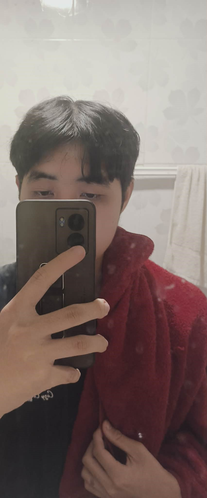

## เพื่อนมีชื่อว่า อังเปา ชื่อจริง ณธรรศ ลิ้มสวัสดิ์

**เหตุผลที่เพื่อนทำไมถึงเลือกเรียนในสายนี้ เพราะอะไร**  
อังเปาเลือกเรียนสาย IT เพราะเขามองว่าเป็นความรู้ที่สามารถนำไปใช้ได้จริงในหลายด้าน ไม่ว่าจะเป็นการทำโปรแกรม เว็บไซต์ ระบบ หรือเทคโนโลยีต่าง ๆ จึงเชื่อว่าสายนี้สามารถต่อยอดได้กว้างและมีโอกาสมากมายในอนาคต  

**คิดว่าเรื่องนี้ท้าทายที่สุดสำหรับคุณคืออะไร และเพราะอะไร**  
สำหรับสิ่งที่อังเปา มองว่าท้าทายที่สุด คือการทำงานเป็นทีม เนื่องจากแต่ละคนมีความคิดเห็นที่แตกต่างกัน การเรียนรู้ที่จะฟังและหาวิธีทำงานร่วมกันจึงเป็นเรื่องสำคัญและท้าทายสำหรับเขา  

**คิดว่าจุดที่อยากพัฒนาของตัวเองคืออะไร เพราะอะไร**  
อังเปาอยากพัฒนาความกล้าแสดงออก โดยเฉพาะเวลาที่ต้องอยู่กับคนที่ไม่คุ้นเคย ทำให้อังเปาเชื่อว่าการเปิดใจและกล้าแสดงความคิดเห็นมากขึ้นจะช่วยให้การทำงานร่วมกับคนอื่นมีประสิทธิภาพมากขึ้น  

**คิดว่าตัวเองเป็นคนเข้าสังคมง่ายหรือต้องใช้เวลาในการปรับตัว และเพราะอะไร**  
ในเรื่องการเข้าสังคม อังเปา มองว่าตัวเองต้องใช้เวลาปรับตัว ตอนแรกอาจจะไม่ค่อยพูดกับคนที่ไม่รู้จัก แต่เมื่อได้ทำความรู้จักกันแล้ว ก็สามารถเข้ากับคนอื่นได้ตามปกติ 

**มีความฝันอะไรที่ยังอยากทำให้สำเร็จมั้ย เพราะอะไรถึงอยากทำ**  
ความฝันของอังเปาคือการได้ทำงานที่ตัวเองชอบและสามารถทำไปได้นาน อังเปา เชื่อว่าการได้ทำงานที่สนใจจะทำให้มีแรงบันดาลใจในการพัฒนาตัวเองอยู่เสมอ

***อังเปา social link***

ig: https://www.instagram.com/2403up/

*** อังเปา image ***

## เพื่อนมีชื่อว่า ออม ชื่อจริง ธนาพิสิษฐ์ อ่อนสร้อย

**เหตุผลที่เพื่อนทำไมถึงเลือกเรียนในสายนี้ เพราะอะไร**  
ออมเลือกเรียนสาย IT เพราะเขาชอบการสร้างหรือการพัฒนาสิ่งของต่างๆ และตอนมัธยมออมได้มีโอกาสไปแข่งสร้างเกมทำให้คิดว่านี่เป็นตัวตนของเขา  

**คิดว่าเรื่องนี้ท้าทายที่สุดสำหรับคุณคืออะไร และเพราะอะไร**  
สำหรับสิ่งที่ออม มองว่าท้าทายที่สุด คือการกล้าแสดงออกและการสื่อสารกับคนอื่นเพราะเขาเป็นคนไม่ค่อยกล้าพูด  

**คิดว่าจุดที่อยากพัฒนาของตัวเองคืออะไร เพราะอะไร**  
ออมอยากพัฒนาการเข้าสังคมให้ดีขึ้น เพราะรู้สึกว่าตัวเองเป็นคนพูดไม่เก่งและ ไม่่อยกล้าแสดงออกในกิจกรรมต่างๆ  

**คิดว่าตัวเองเป็นคนเข้าสังคมง่ายหรือต้องใช้เวลาในการปรับตัว และเพราะอะไร**  
ในเรื่องการเข้าสังคม ออม มองว่าตัวเองต้องใช้เวลาปรับตัวค่อนข้างนาน เพราะออมไม่ค่อยกล้าพูดหรือไม่กล้าแสดงออก

**มีความฝันอะไรที่ยังอยากทำให้สำเร็จมั้ย เพราะอะไรถึงอยากทำ**  
ความฝันของออม คืออยากลองทำคาเฟ่คอมพิวเตอร์ เพราะตัวออมเป็นคนชอบกินกาแฟ และชอบนั้่งคาเฟ่

***ออม social link***

FB:https://www.facebook.com/tanapisit.onsroi/

IG:https://www.instagram.com/tanapisit_onsroi.real/

*** ออม image ***
